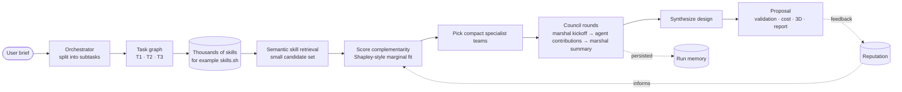

# 🔮 Cadre

**A team of specialized agents for tasks too complex for a single agent.**

Cadre turns a high-level design brief into a coordinated project: it splits
the work, finds the right specialist agents, lets each team deliberate, and
assembles the result into a proposal with validation, cost, rendering, and a
report.


## What Cadre Does

Cadre is a Python pipeline for multi-agent team formation.
Instead of asking one large agent to do everything, it builds small teams
around each subtask:

- An orchestrator decomposes the brief into a task graph.
- A skill search step narrows a large skills marketplace, such as
  [skills.sh](https://skills.sh/), to the few capabilities relevant to each
  subtask.
- A Shapley-style scoring step picks compact teams with complementary skills.
- A marshal coordinates each team's Council round.
- The system synthesizes the outputs into a final design package.

This is the central methodological move: when there are thousands of possible
skills, Cadre does not ask an LLM to read or choose from the whole catalog.
It first uses semantic retrieval to create a small candidate set, then scores
which skills add the most marginal value to the team.

MongoDB is used as the skill catalog, vector search index, Council message log, run audit trail, replay store, and reputation memory.

## Method At A Glance



The important idea is simple: **split the project, staff each piece with a
small specialist team, preserve the deliberation, and remember who contributed
well.**

## Demo

Run the app locally:

```bash
conda env create -f environment.yml
conda activate coalitions
streamlit run app.py
```

In the app, click **Run pipeline**. The main tabs show:

- **Methodology**: bird's-eye view of the approach.
- **Task graph**: subtasks and dependencies.
- **Teams**: selected skills and assigned agents.
- **Council**: recorded team deliberation.
- **Validation / Cost / Rendering / Report**: final package.
- **Reputation**: per-run credit and memory.

## Replay Mode

The public Streamlit demo runs in strict replay mode. It does not call OpenAI
live. Instead, it uses recorded LLM responses from:

```text
data/llm_replay_cache.json
```

Only the curated dropdown prompts are supported in this mode.

To refresh the replay cache:

```bash
# Run curated prompts once with live LLM calls and cache enabled.
USE_MOCK_LLM=false python -m src.run --prompt "<demo prompt>"

# Export the cached responses into the file used by Streamlit Cloud.
python scripts/export_llm_cache.py
```

Commit the refreshed `data/llm_replay_cache.json` before deploying.

## Setup

Create the environment:

```bash
conda env create -f environment.yml
conda activate coalitions
python -c "import streamlit, pymongo, openai, langgraph; print('OK')"
```

Create local secrets:

```bash
cp .env.example .env
```

Then edit `.env` with your MongoDB connection string and, for live cache
generation, an OpenAI API key.

## CLI

```bash
python -m src.run --prompt "Build me a bridge for 50 cars per hour - modern design"
python -m src.run --replay <run_id>
```

## Tests

```bash
pytest tests/ -v
```

## Deployment

The app is designed for Streamlit Community Cloud.

1. Deploy `app.py` from the `master` branch.
2. Add `MONGODB_URI` and `MONGODB_DB` in Streamlit Secrets.
3. Ensure `data/llm_replay_cache.json` is committed.
4. Allow Streamlit Cloud to reach the MongoDB cluster.

The deployed app should use the committed replay cache for LLM outputs. If the Council tab shows generic placeholder text, the deployment is using stale code, stale persisted runs, or an incomplete replay cache.

## Repository Map

```text
app.py                    Streamlit demo
src/pipeline/             orchestration, synthesis, validation, cost, reporting
src/agents/               team formation and Council protocol
src/llm/                  live, cached, and replay LLM access
data/llm_replay_cache.json recorded demo LLM responses
docs/                     architecture notes and deeper methodology
```

For deeper implementation notes, see:

- [docs/ARCHITECTURE.md](docs/ARCHITECTURE.md)
- [docs/MATCHING_PIPELINE.md](docs/MATCHING_PIPELINE.md)
- [docs/LANGGRAPH.md](docs/LANGGRAPH.md)
