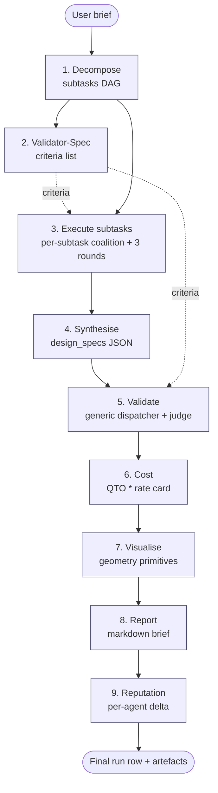
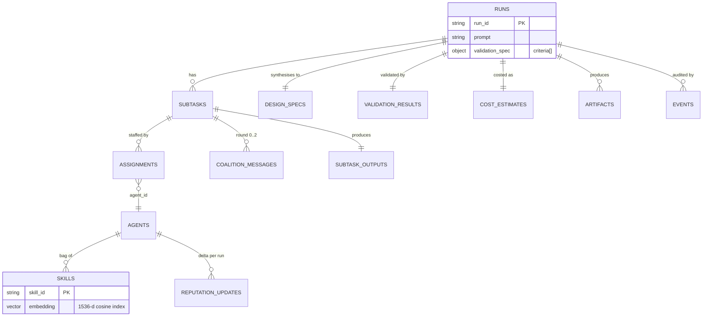
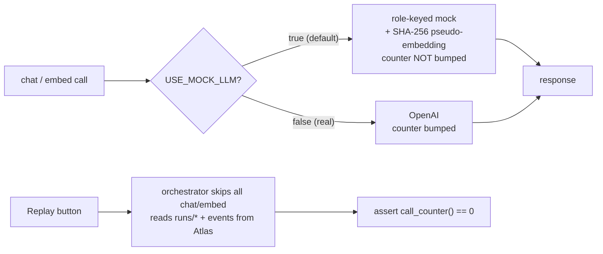

# Architecture & Design

This document explains how Agent Coalitions is built and why. It is the long-form companion to `MVP_DESIGN.md` (the contract); the cooperative-game-theory background sits in `GAME_THEORY_PRIMER.md`.

> **Looking for the elevator pitch?** See [MATCHING_PIPELINE.md](MATCHING_PIPELINE.md) for a single-page walkthrough of how a free-text requirement becomes a working agent team — vector search → coverage floor → greedy coalition → set-cover → Shapley credit — with infographics and the *"MongoDB plays five distinct roles"* cheat-sheet.

The system was built for a one-day hackathon, so every choice is calibrated to the question: *what produces a credible, judgeable end-to-end demo within a single working day, while keeping every interesting design decision honest?*

---

## 1. What the system does, end to end

A user submits a single design brief, e.g. *"design a 2 km bridge for 50 cars/h with trucks, modern aesthetic"*. The pipeline returns a conceptual bridge proposal: a final spec table, a deterministic validation card, a costed quantity take-off in EUR, a side-elevation visualisation, and a markdown brief.

Internally, this is delivered by a fixed nine-stage sequential pipeline:

1. **Decompose** — a single LLM call splits the brief into a 5–8-node DAG of subtasks (site, loads, materials, structural system, aesthetics, validation prep, final synthesis).
2. **Validation-spec** — a Validator-Spec agent reads the brief and emits a small list of acceptance criteria (id / must-have / optional structured `check` block with op `lte|gte|between|present|equals_any`). The list is persisted on the `runs` row and threaded into every marshal kickoff so each coalition is briefed on what the design will be judged on. On parse failure the pipeline falls back to a single qualitative criterion.
3. **Execute subtasks** — for each subtask, the system retrieves candidate skills via Atlas Vector Search, forms a small coalition of skills, picks ≤ 3 agents that cover those skills, runs a three-round blackboard exchange (marshal kickoff → parallel agent contributions → marshal reconcile), and writes a token-capped subtask output.
4. **Synthesise** — one LLM call rolls every subtask output into a structured `design_specs` JSON.
5. **Validate** — a generic dispatcher evaluates each criterion in `runs.validation_spec` against the synthesised spec (with a small set of computed virtual fields such as `span_to_depth_ratio` so the criteria can stay in natural top-level vocabulary). Criteria without a structured `check` are recorded as `qualitative` and surfaced to the LLM judge, which scores each subtask output on clarity/completeness/consistency.
6. **Cost** — a quantity-take-off heuristic over the spec, multiplied by a fixed `cost_model.json` rate card, with a 10% finishing premium and 15% contingency, and a one-paragraph surveyor narrative.
7. **Visualise** — an LLM-backed Visualiser agent (with a deterministic primitives fallback) emits a generic 3D geometry artifact: a list of axis-aligned boxes and polylines with absolute world coordinates, stored as an `artifacts` row of kind `geometry_json`. The renderer in the UI is intentionally domain-agnostic; see §6.
8. **Report** — a markdown brief with the final spec table, validation card, cost roll-up, and a per-team contribution section.
9. **Reputation** — every participating agent gets a per-run reputation delta scaled by load (subtasks participated in) and quality (mean contribution score), persisted on the `agents` collection.

The pipeline is also **replayable**: given a `run_id`, the orchestrator can re-read every artefact from MongoDB without making any LLM calls. This is asserted in code (`openai_client.call_counter() == 0` after replay) and exercised by the Streamlit "Replay current" button.

---

## 1b. System design at a glance

Four diagrams, each capturing one design axis: **components**, **pipeline dataflow**, **data model**, and the **mock/real flag**. They are reference material for the longer sections that follow; nothing in them is novel — they just make the cross-cutting structure visible on one screen.

### Component view

The system is six packages, each with a single concern. The UI talks only to the orchestrator and to MongoDB (read-only on replay); the orchestrator owns every write through a thin `db/` write layer.

```mermaid
flowchart LR
    subgraph UI["Streamlit UI (app.py)"]
        TABS["Tabs: Plan · Coalitions · Blackboard ·\nSpec · Validation · Cost · Rendering · Report"]
    end

    subgraph PIPE["src/pipeline (orchestrator + 9 stages)"]
        ORCH["orchestrator.run_pipeline()"]
        DEC["decomposer"]
        VSPEC["validator_spec"]
        EXEC["execution"]
        SYN["synthesis"]
        VAL["validation"]
        SURV["surveyor (cost)"]
        VIZ["visualiser"]
        REP["reporter"]
        REPU["reputation"]
    end

    subgraph AG["src/agents (coalition mechanics)"]
        COAL["coalitions\n(rank-1 Shapley + pairwise)"]
        SC["set_cover\n(skill -> agents)"]
        BB["blackboard"]
        MARSH["marshal\n(round 0 / round 2)"]
    end

    subgraph LLM["src/llm"]
        CHAT["openai_client.chat / embed"]
        MOCK["mock (role-keyed)"]
        TPL["prompts (Jinja2)"]
    end

    subgraph DB["src/db"]
        WRITES["writes.insert_with_event"]
        MATCH["matching ($vectorSearch)"]
    end

    subgraph ATLAS[("MongoDB Atlas (M10, eu-west-2)\n13 collections + skills vector index")]
    end

    UI -->|run / replay| ORCH
    UI -.read.-> ATLAS
    ORCH --> DEC --> VSPEC --> EXEC --> SYN --> VAL --> SURV --> VIZ --> REP --> REPU
    EXEC --> COAL --> SC --> MARSH --> BB
    DEC & VSPEC & SYN & VAL & SURV & VIZ & REP & MARSH --> CHAT
    CHAT --> MOCK
    CHAT --> TPL
    EXEC -->|skills query| MATCH
    ORCH & EXEC & MARSH & VAL & VIZ & REP & REPU --> WRITES
    WRITES --> ATLAS
    MATCH --> ATLAS
```

### Pipeline dataflow

A single brief flows through nine stages; each stage's output is a row in MongoDB and an event on the bus. The `validation_spec` derived from the prompt is the only artifact that flows *backwards* into an earlier-running stage (it is read by every marshal kickoff during execution).



### Data model (collections + key relationships)

Thirteen collections, one vector index. `events` is the audit spine — every domain insert pairs with an event row, which is what makes a replay a *read* rather than a re-execution.



### The single global flag: mock vs real

Exactly one switch (`USE_MOCK_LLM`) decides where the LLM and embedder traffic goes. Everything else — Atlas, vector search, writes, replay — is identical in both modes. The replay path is special: it reads only.



---


## 2. Why MongoDB Atlas.

**MongoDB Atlas is used.** All thirteen domain collections (`runs`, `subtasks`, `assignments`, `coalition_messages`, `subtask_outputs`, `design_specs`, `validation_results`, `cost_estimates`, `artifacts`, `agents`, `skills`, `reputation_updates`, `events`) are live, hosted on an M10 cluster in `eu-west-2`, indexed and exercised on every run.


Decision rationale:

- **Single source of truth.** The blackboard, the agent registry, the assignment ledger, the cost roll-up, the artefacts, and the audit log all live in one database. Replay correctness becomes a property of the storage layer, not the application layer.
- **Atlas Vector Search.** The skills index supports cosine similarity over 1536-dim embeddings with optional metadata filters. The same index serves both mock and real modes; only the embedder changes. A pure-Python cosine fallback in `src.matching` exists for the case where the index is briefly unavailable, but the demo uses `$vectorSearch`.
- **Auditability by construction.** Every domain insert is paired with an `events` row via `insert_with_event(...)`, so the `events` collection alone reconstructs the full timeline of any run. This is what makes the replay button a one-screen demo and not a re-execution.

---

## 3. The skill–agent decomposition

The system distinguishes **skills** from **agents**:

- A **skill** is a capability vector with provenance (name, category, embedding, prior reputation, weekly install proxy from a public marketplace). The seed corpus has 36 hand-authored entries spanning structural engineering, materials, aesthetics, geometry, mathematics, and writing. Post-hackathon, this swaps for a 150-entry pull from a real skills index without any code change.
- An **agent** is a small bag of 2–4 skills. There are 21 agents in the seed (20 multi-skill plus one synthetic marshal). Every domain assignment is an agent; the marshal is the only agent the system always selects.

Why this split matters: the *retrieval problem* (which capabilities does this subtask need?) is naturally posed against skills, while the *delegation problem* (who should actually do the work?) is naturally posed against agents. Coupling them at the data layer would force one structure on both, and the demo would either retrieve the wrong unit or assign the wrong unit.

Concretely:

- The vector index lives on `skills.embedding`, never on `agents`. A subtask's `required_capabilities` are embedded one at a time and each query returns up to eight candidate skills.
- Coalition formation operates on the resulting candidate-skill set (see §4).
- Once a skill coalition is chosen, a separate **weighted greedy set-cover** picks ≤ 3 agents whose union of skills covers it. The weight is `coverage × (1 + 0.05 × polyvalence) × prior_reputation`, mildly preferring agents who can carry multiple skills at once.

The contribution-score column visible in the UI is the *solo* coalition value of the agent's seat, not the agent's prior reputation. Two agents with the same prior can produce different scores in the same coalition because they are seated against different partners.

---

## 4. Coalition formation: pairwise complementarity.

The coalition value is a **rank-1 Shapley with pairwise complementarity**:

```
v(C) = Σ_i α·coverage_i + β·prior_reputation_i + γ·log(1+installs_i)
       + λ · Σ_{i<j} (1 - cos_sim(emb_i, emb_j))
```

with `α=0.6, β=0.3, γ=0.1, λ=0.4`. We greedily seed with the highest-solo skill, then add skills whose marginal value exceeds a threshold `τ=0.05`, capping coalition size at 3. The complementarity term `(1 - cos_sim)` rewards bringing in a skill that is *different* from what is already in the coalition — i.e. it specifically discourages stacking three near-duplicate skills, which is the failure mode of naive top-k retrieval.

Three deliberate non-choices, each a mistake we did not make:

- **It is not a price-clearing market.**  We deliberately do not call this system a market — there are no prices, no private information, and no incentive-compatibility guarantees. See [MVP_DESIGN.md](MVP_DESIGN.md) Appendix A for the precise framing.
- **It is not a full Shapley computation.** Full Shapley over even a 15-candidate pool is 2^15 coalitions; the rank-1 + pairwise approximation is closed-form and runs in microseconds, which is the right complexity budget for a demo.
- **It is not pure top-k cosine.** Pure top-k would silently produce three indistinguishable skills for any subtask whose primary capability has near-duplicates in the index. The complementarity bonus is what makes the assignment *interesting*, and it is the thing the UI's "Coalitions" tab is built to show.

Tests in `tests/test_coalitions.py` pin down each property: highest-solo seeding, cap of 3, and the complementarity bonus actually lifting the coalition value.

---

## 5. The blackboard protocol

For each subtask, the marshal and the coalition exchange exactly three rounds of messages:

1. **Round 0 (kickoff).** The marshal posts a single message that scopes the subtask, lists the coalition agents and their angles, and surfaces one consistency risk to watch.
2. **Round 1 (parallel contributions).** Each non-marshal agent in the coalition posts one contribution. Crucially, contributions are mutually invisible *within* round 1 — every agent sees only the kickoff and the upstream subtask summaries it depends on. This is the property that makes the round actually parallel rather than a single sequential thread, and it is the property that makes the marshal's reconcile worth doing.
3. **Round 2 (reconcile).** The marshal reads the round-1 messages and posts a single unified summary, truncated to 200 tokens. That summary is the subtask's output and the only thing downstream subtasks see.

A revision round (round 3) is supported by the data model but omitted in the demo for runtime budget. The design intent is that round 3 fires only when the marshal's reconcile fails an internal consistency check; in a longer-running pipeline this is where backtracking lives.

The 200-token cap is enforced with `tiktoken cl100k_base` and tested in the end-to-end test. It serves two purposes: it bounds the size of the synthesiser's input regardless of how chatty an LLM happens to be, and it forces the marshal to take an editorial position rather than concatenating contributions.

---

## 6. Validation: deterministic first, judge second

Validation is split into two layers, in this order:

- **Deterministic checks** (`src/pipeline/validation.py`): five closed-form checks over the synthesised spec — span-to-depth ratio, support-count consistency, live-load arithmetic, material/span plausibility, lane geometry. Each returns `pass` / `warning` / `fail`. The aggregator returns `conceptual_pass`, `conceptual_pass_with_warnings`, or `conceptual_fail`. These are unit-tested and they are the only thing the cost section and the reputation deltas key off.
- **LLM judge**: a per-subtask 0–10 score on clarity, completeness, and consistency. This is *informational only*; nothing in the pipeline conditions on it. Judges are notoriously unreliable, so they sit downstream of the deterministic gate, not upstream.

The reason for that ordering is that an LLM judge can be made to say almost anything by phrasing; a span-to-depth check cannot. By the time the judge speaks, the structural sanity of the spec has already been decided.

---

## 7. Reputation: load × quality, not flat

After every run, each participating agent gets a reputation delta. The delta is per-agent, not per-run, and is built from two factors:

- **Load factor** = subtasks the agent appeared in, divided by the total number of subtasks.
- **Quality factor** = mean of the agent's solo contribution scores across those subtasks.

Both are normalised into `[0, 1]` and combined with a smoothing floor:

```
delta_agent = base × (0.5 + 0.5 × load) × (0.5 + 0.5 × quality)
```

with `base = +0.04` for a clean pass, `+0.02` for a pass-with-warnings, and `-0.04` for a fail. The smoothing floor of `0.5` means even a single-subtask, low-score participant still moves the needle; conversely, a high-load, high-quality agent climbs roughly 4× as fast. Reputations are clipped to `[0, 1]` and persisted on the `agents.reputation` field, with an audit row in `reputation_updates`.

This is the property that makes a multi-run demo more interesting than a single-run demo: across three or four runs, the leaderboard re-orders in a way that traces back to who actually carried which subtask.

---

## 8. Mock mode is a deliberate first-class citizen

`USE_MOCK_LLM=true` is the default for the live demo, and the design treats it as a feature rather than a fallback. Concretely:

- The mock chat layer is **role-keyed**, not generic. Calling `chat(prompt, role="decomposer")` returns the deterministic 7-subtask DAG; `role="judge"` returns a per-subtask varied JSON; `role="marshal_reconcile"` returns a subtask-specific consensus paragraph; and so on. The pipeline therefore exercises every JSON parse, every truncation, and every downstream stage exactly the way it would in real mode.
- The mock embedder is a **content-hashed pseudo-embedding**. It is deterministic and stable, so two identical query strings produce identical hits and the demo never flickers. Because the hash is content-dependent, the *plumbing* of vector search is exercised honestly, but **semantic ranking quality is not**: similar phrases will not be especially close in the mock embedding space. Real-mode runs (used for the demo video) are where the retrieval quality story can actually be told.
- The mock chat **never bumps the LLM call counter**. This is what makes the replay assertion (`call_counter() == 0` after replay) trivially safe in mock mode: replays cannot produce phantom counter bumps.

The single global flag means there is exactly one place to change behaviour, and exactly one place to assert it. The chat client short-circuits to the mock as its first action, so a misconfigured run cannot accidentally hit a real API.

The Jinja2 templates under `src/prompts/` are **always rendered**, even in mock mode. This is intentional: it means the templates are executable on every run, so a syntax error in a template is caught before a live demo starts. A designer can iterate on prompt wording with `streamlit run app.py` and see the rendered text without ever touching Python.

---

## 9. Why a plain function pipeline (not LangGraph)

A LangGraph state machine was scoped in but not built. The pipeline is sequential and fixed in topology — there is no branching, no loops, no human-in-the-loop interrupts, no streamed tool calls. A plain function pipeline expresses that exactly, can be type-checked, and is trivially replayable.

LangGraph remains an installed dependency so that adding a revision round (round 3) or a multi-prompt session does not require pulling in new tooling later. The escape hatch was approved in MVP_DESIGN Amendment 3.14 specifically to keep the orchestrator readable on demo day.

---

## 10. Visualisation: a generic renderer fed by a Visualiser agent

The picture in the Rendering tab is not produced ad-hoc by the UI. It is the output of a real pipeline stage (`src/pipeline/visualiser.py`) that runs between the cost stage and the report stage, and writes an `artifacts` row of kind `geometry_json` for every run. That row is part of the replay surface: re-running the UI on a past `run_id` re-draws the picture without recomputing anything.

The artifact is a **generic 3D primitive list** with three keys:

```json
{
  "primitives": [
    {"kind": "box",  "x": [0, 2000], "y": [-6, 6], "z": [14.3, 15.5],
     "color": "#2c2c2c", "name": "deck"},
    {"kind": "line", "points": [[1000, 4.8, 28.6], [1100, 4.8, 15.5]],
     "color": "rgba(40,40,40,0.65)", "width": 1.5, "name": "cable_1_3_1_4"}
  ],
  "title": "Multi-Span Cable Stayed · 2000 m total · longest span 200 m",
  "axes":  {"x": "length (m)", "y": "width (m)", "z": "height (m)"}
}
```

Two pieces, deliberately separated:

- **The Visualiser agent** (`src/pipeline/visualiser.py`) is responsible for translating *whatever* the design spec looks like into this primitive list. There are two execution paths:
  - In **mock mode** (the demo default), a deterministic Python builder reads the bridge-spec schema (`total_length_m`, `span_layout`, `deck_width_m`, `bridge_type`, …) and emits primitives directly. This is fast, offline and reproducible. It is the right tool when the spec schema is fixed and known in advance.
  - In **real mode**, the agent calls `chat(role="visualiser")` with the spec JSON and the primitive schema (template at `src/prompts/visualiser.j2`). The reason an LLM belongs here is that the synthesised spec schema is **domain-dependent**: a bridge has `span_layout`, a rollercoaster has `track_segments` and `loop_radii`, a tower has `floor_count`. A hand-written Python switch cannot enumerate every domain a judge might propose at the demo. The LLM reads any spec shape and emits the same uniform primitives JSON. Output is parsed and validated against a minimal schema (`kind` ∈ {box, line}; box has well-formed `x/y/z` ranges; line has ≥ 2 three-component points). Any failure logs a warning and falls back to the deterministic builder so the pipeline never crashes mid-demo.
  - Either path tags the artifact with a `source` field (`deterministic` / `llm` / `deterministic_fallback`) so a replay can tell where the picture came from.
- **The renderer** (`src/ui/render3d.py`) is intentionally dumb and generic. It draws a `box` primitive as a `go.Mesh3d` with the standard 12-triangle cuboid topology, and a `line` primitive as a `go.Scatter3d` polyline. It has no knowledge of bridges, decks, or cables. Adding a new primitive type later (`cylinder`, `mesh`) is a one-function change in the renderer; it does not require touching any pipeline code.

Plotly is the chosen 3D library because it was already a dependency for the other tabs and it gives the demo interactive rotate / zoom / hover for free. PyVista was considered and rejected: it is VTK-based, beautiful in a desktop window, and does not embed cleanly in Streamlit without an extra third-party component (`stpyvista`) — extra dependency, extra demo-day failure mode, negligible visual gain over Plotly. The renderer fixes `aspectmode="data"` so 1 m on the x axis is the same screen length as 1 m on the z axis — a 2 km × 30 m structure stays recognisably a deck rather than a cube.

Coordinate convention is fixed: x along structure length, y across width, z up. This is the only contract between the agent and the renderer; everything else is data.

---

## 11. Repository layout

```
app.py                       # Streamlit UI (run with: streamlit run app.py)
cost_model.json              # EUR unit costs for the surveyor
ARCHITECTURE.md              # this document
README.md                    # quick-start and live demo flow
MVP_DESIGN.md                # the contract
GAME_THEORY_PRIMER.md        # cooperative-game-theory background
TODO.md                      # post-hackathon backlog

src/
  run.py                     # CLI entrypoint

  core/
    config.py                # pydantic-settings; reads .env
    progress.py              # progress event bus for the live UI
    tokens.py                # tiktoken count + truncate (200-tok cap)

  llm/
    mock.py                  # deterministic embeddings + role-keyed chat
    openai_client.py         # real-mode wrapper; routes by USE_MOCK_LLM
    prompts.py               # Jinja2 template loader (render(name, **ctx))

  prompts/                   # *.j2 templates, one per LLM role

  db/
    client.py, indexes.py, writes.py, seed.py
    matching.py              # Atlas $vectorSearch + cosine fallback

  agents/
    coalitions.py            # rank-1 Shapley + pairwise complementarity
    set_cover.py             # weighted greedy skill→agent set cover
    blackboard.py            # post / read coalition_messages
    marshal.py               # round 0 kickoff + round 2 reconcile

  pipeline/
    decomposer.py, execution.py, synthesis.py, validation.py,
    surveyor.py, visualiser.py, reporter.py, reputation.py, orchestrator.py

  ui/
    render3d.py              # generic primitives -> plotly 3D figure
    bridge_view.py           # legacy 2D side-elevation (kept for reference)

  scripts/
    ingest_skills.py, ping_mongo.py, test_vector_search.py

tests/
  test_matching.py, test_coalitions.py, test_validation.py,
  test_e2e_mock.py           # full pipeline + replay invariants
```

Each top-level package corresponds to one concern: `db/` only writes Mongo, `agents/` only handles coalition mechanics, `pipeline/` only handles the orchestration of stages, `llm/` only handles model traffic, `prompts/` only holds template copy, and `ui/` only holds rendering. The thinnest module is intentionally `progress.py`: a tiny event bus so the pipeline can notify the UI without taking on a UI dependency.
